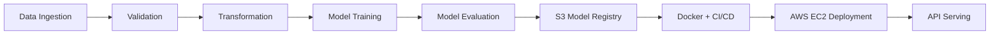

---

# 🚗 MLOps Project – Vehicle Insurance Data Pipeline

Welcome to the **Vehicle Insurance MLOps Project** – an end-to-end machine learning pipeline designed to demonstrate real-world data processing, model deployment, and production automation. This project showcases a robust architecture using modern tools like **MongoDB**, **AWS**, **Docker**, and **GitHub Actions** to streamline the entire ML lifecycle — from data ingestion to deployment.

Whether you're a recruiter evaluating DevOps skills or a developer looking to learn MLOps hands-on, you're in the right place. 👇

---

## 📂 Project Structure Overview

### 🧱 Project Initialization

* Execute `template.py` to generate the full project directory structure.
* Add package configurations in `setup.py` and `pyproject.toml`.

### ⚙️ Environment Setup

```bash
conda create -n vehicle python=3.10 -y
conda activate vehicle
pip install -r requirements.txt
```

Verify:

```bash
pip list
```

---

## 🗃️ MongoDB Atlas Integration

### 🛠️ Setup MongoDB Atlas

* Create a free [MongoDB Atlas](https://www.mongodb.com/cloud/atlas) cluster.
* Allow IP access from `0.0.0.0/0`.
* Save the Python-compatible connection string.

### 📤 Push Dataset to MongoDB

* Add your dataset to the `notebook/` folder.
* Use `mongoDB_demo.ipynb` to push data to MongoDB.
* Verify via **Atlas → Browse Collections**.

---

## 📊 Data Engineering & Logging

### 🛠️ Logging & Exceptions

* Create reusable modules for custom logging and exception handling.
* Test using `demo.py`.

### 🔍 Exploratory Data Analysis

* Use EDA notebooks for feature engineering and data exploration.

---

## 📥 Data Ingestion Pipeline

* Define MongoDB configs in `configuration.mongo_db_connections.py`.
* Implement ingestion logic in:

  * `data_access/`
  * `components.data_ingestion.py`
* Configure entities in `entity/config_entity.py` and `artifact_entity.py`.

### 🌐 Set MongoDB Environment Variable

```bash
# Bash
export MONGODB_URL="mongodb+srv://<user>:<password>@cluster.mongodb.net/..."
# PowerShell
$env:MONGODB_URL = "mongodb+srv://<user>:<password>@cluster.mongodb.net/..."
```

---

## 🔍 Validation, Transformation & Model Training

### ✅ Data Validation

* Define schema in `config.schema.yaml`.
* Implement checks in `utils.main_utils.py`.

### 🔄 Data Transformation

* Handle encoding, scaling, and pipelines in `components.data_transformation.py`.

### 🧠 Model Training

* Create training pipeline in `components.model_trainer.py` using logic from `entity/estimator.py`.

---

## ☁️ AWS Model Deployment & Storage

### 🌐 AWS Configuration

* Create IAM user with `AdministratorAccess`.
* Set credentials:

```bash
export AWS_ACCESS_KEY_ID="..."
export AWS_SECRET_ACCESS_KEY="..."
```

### 📦 Model Upload to S3

* Create S3 bucket: `my-model-mlopsproj`
* Push/pull models using:

  * `src/aws_storage/`
  * `entity/s3_estimator.py`

---

## 🚀 Model Evaluation, Deployment & API

### 📈 Model Evaluation & Pusher

* Evaluate model performance
* Push best models to S3
* Build prediction pipeline in `app.py`

### 🖼️ Frontend Integration

* Add UI assets to `/static` and `/template/` folders.

---

## 🔄 CI/CD Automation with GitHub Actions & Docker

### 🐳 Docker Setup

* Create a `Dockerfile` and `.dockerignore`.

### ⚙️ GitHub Actions

* Add GitHub secrets:

  * `AWS_ACCESS_KEY_ID`
  * `AWS_SECRET_ACCESS_KEY`
  * `ECR_REPO`
* Trigger build and deployment on push to `main`.

### 🖥️ AWS EC2 + ECR Deployment

* Launch EC2 instance, install Docker.
* Set up EC2 as a GitHub self-hosted runner.
* Expose port **5080** to access your app:

  ```bash
  http://<public-ip>:5080
  ```

---

## 📌 Full MLOps Workflow Summary



---

## 🔐 Secrets & Environment Setup

| Tool       | How to Configure               |
| ---------- | ------------------------------ |
| MongoDB    | `.env` or terminal export      |
| AWS S3/ECR | GitHub Secrets or local export |
| EC2 Runner | Self-hosted via GitHub Actions |

---

## 🙌 Connect & Collaborate

If this project helped you, or you’re building something similar:

* ⭐ Star the repo
* 🐛 File an issue
* 🤝 [Connect on LinkedIn](https://www.linkedin.com/in/gouravmishra121)

---

> Built with ❤️ to demonstrate real-world MLOps workflows for data-driven deployments.

---
